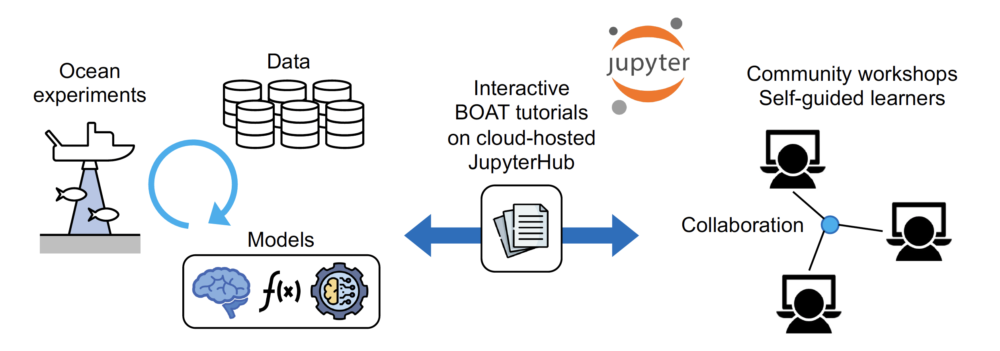

# Welcome to {{hackweek}}!

The Bridge to Ocean Acoustics and Technology (BOAT) program aims to "open up the funnel" of student intake to ocean acoustics, and preserve the institutional knowledge in this field in an interactive, accessible, and attractive form. We focus on:
1) Create open, executable, and web-hosted tutorials that encapsulate fundamental ocean acoustics knowledge and techniques as living documents, and
2) Grow the ocean acoustics education and research community through education and collaborative resource deveopment workshops.

In the current pilot stage, we are building tutorials on fundamental ocean acoustics concepts that can serve as "blueprints" for further developments on more advanced topics.

Our long-term goal is to build a strong learner-research-contributor community who jointly support this program to expand access to ocean acoustics theory and practice and to recruit the next generation of talent to this field.


<!--📖 On this JupyterBook website you'll find [tutorials](tutorials/index). All tutorials are Jupyter Notebooks, 
designed to be run interactively, but also rendered on this website for convenience.-->

<!-- 👩‍💻 During a Hackweek teams work collaboratively on different projects. Read more about the projects and results on our [projects page](projects/index) -->

<!-- 💡 Learn more about hackweeks hosted by the [University of Washington eScience Institute](https://uwhackweek.github.io/hackweeks-as-a-service/intro.html), or check out our publication describing the hackweek educational model {cite:p}`Huppenkothen2018`. -->


## The BOAT Philosophy

We build open, executable tutorials to connect learners to ocean acoustics knowledge on modern computing infrastructure.




```{admonition} Quick links
:class: seealso
* [Seattle workshop](./workshop_seattle) (March 24-25, 2025)
* [New Orleands workshop](./workshop_new_orleans) (May 17-18, 2025)
* GitHub organization: {{ github_org_url}}
```
